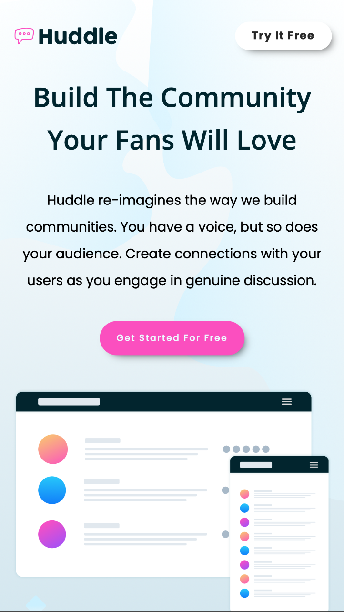

# Frontend Mentor - Huddle landing page with alternating feature blocks

## Welcome! 👋

# Frontend Mentor - Huddle landing page with alternating feature blocks solution

This is a solution to the [Huddle landing page with alternating feature blocks challenge on Frontend Mentor](https://www.frontendmentor.io/challenges/huddle-landing-page-with-alternating-feature-blocks-5ca5f5981e82137ec91a5100). Frontend Mentor challenges help you improve your coding skills by building realistic projects. 

## Table of contents

- [Overview](#overview)
  - [The challenge](#the-challenge)
  - [Screenshot](#screenshot)
  - [Links](#links)
- [My process](#my-process)
  - [Built with](#built-with)
  - [What I learned](#what-i-learned)
  - [Continued development](#continued-development)
  - [Useful resources](#useful-resources)
- [Author](#author)
- [Acknowledgments](#acknowledgments)

**Note: Delete this note and update the table of contents based on what sections you keep.**

## Overview

### The challenge

Users should be able to:

- View the optimal layout for the site depending on their device's screen size
- See hover states for all interactive elements on the page

### Screenshot

### Links

- Live Site URL: 

## My process

### Built with

- Semantic HTML5 markup
- CSS custom properties
- Flexbox
- CSS Grid
- Mobile-first workflow

### What I learned

I picked this project because I wanted to try my hands on creating a reponsive website. I learnt that it is always better to start from little add-ons like colors, typograpghy before moving on to the functionality of the webpage. 

This style helped me to work through the needs of the webpage without overwheming my stylesheet with too much complicated things at the beginning stage of my design while achieving a fully responsive design.

### Continued development

This project on FrontEnd Mentor has other level of diffulty and I intend to learn further and implement the curvy card designs.

### Useful resources

- [Example resource 1](https://www.youtube.com/watch?v=wARbgs5Fmuw) - This helped me in understanding the tips and concepts in creating reponsive typography.

## Author

- Website - [Joyce Fred]
- Frontend Mentor - [@Jay-Fred31](https://www.frontendmentor.io/profile/Jay-Fred31)
- Twitter - [@joycefdev](https://www.twitter.com/joycefdev)

## Acknowledgments

I have really learnt so much from Kevin Powell videos, you can check out his youtube channel if you want to learn more about building responsive projects. 

